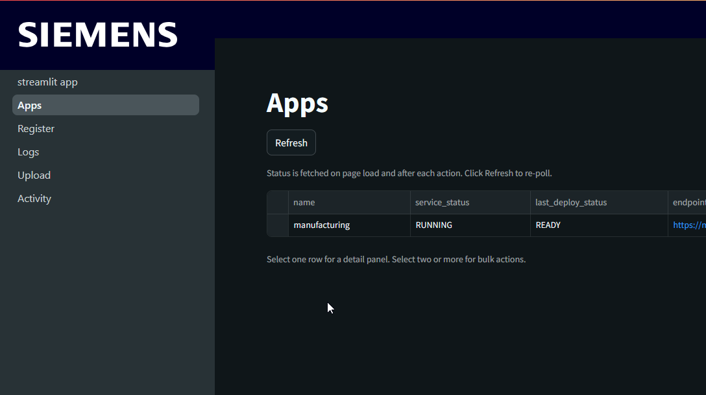
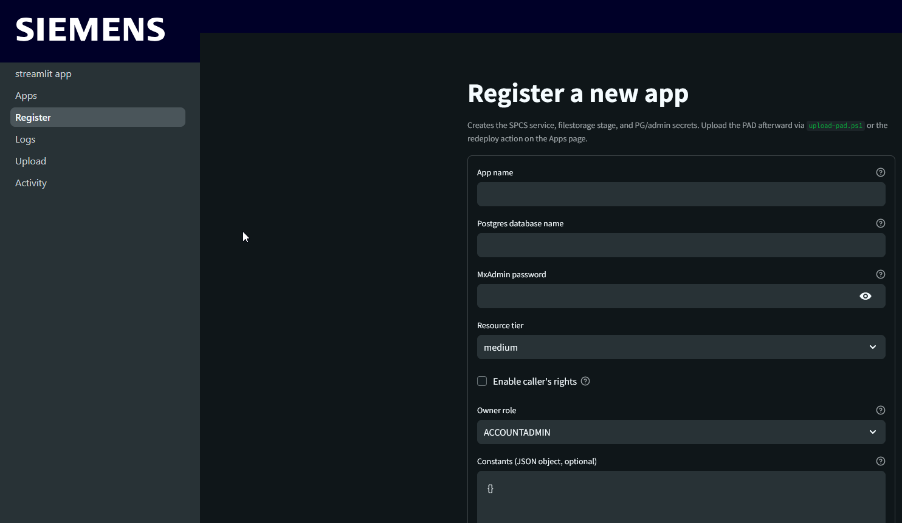
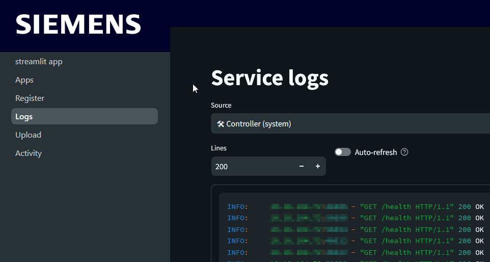
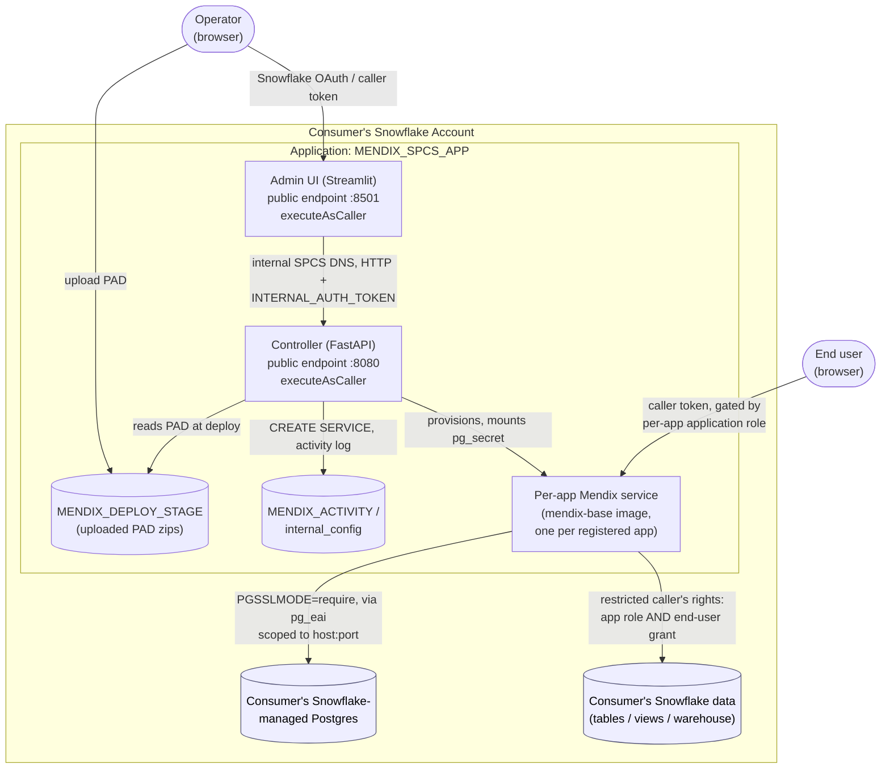

# Mendix on Snowpark Container Services

Run Mendix applications natively on Snowflake using Snowpark Container Services (SPCS). No Mendix Cloud, no Kubernetes operator, no external infrastructure. The Mendix runtime runs as a container inside Snowflake, connected to a Snowflake-managed Postgres database, with file storage on Snowflake stages. Users authenticate via Snowflake identity and can query Snowflake data as themselves.

## Screenshots

The Streamlit admin UI manages apps from a browser, themed to Siemens iX:

**Apps overview** — service and deploy status for every app you own, with refresh and bulk actions.



**Register a new app** — provisions the SPCS service, filestorage stage, and secrets; sets the owner role and resource tier.



**Service logs** — tail any app's logs, plus the controller's and admin UI's own logs for privileged operators.



**Activity** — an audit log of every mutating operation (deploy, suspend, resume, constants/spec edit, delete), recording the operator, action, target app, and outcome.


## What This Is

A Snowflake Native App with Containers that runs Mendix apps on SPCS inside the consumer's own account:

- **Native App packaging** (`native-app/`) - Manifest, `setup_script.sql` (creates the deploy stage, app registry, callbacks, and both services at install), listing config, and the release tooling (`scripts/build-and-push.ps1`, `scripts/release.ps1`).
- **Controller** (`Controller/`) - A FastAPI service, owned and started by the app, that manages the full app lifecycle: provisioning per-app services, storing constants as Snowflake secrets, and deploying new PAD versions without Docker rebuilds per app.
- **Admin UI** (`Admin UI/`) - Streamlit admin frontend running as a sibling app-owned service. Calls the controller over internal SPCS DNS and lets operators manage apps from a browser. Pages: app status and lifecycle (deploy, suspend, resume, delete), PAD upload, constants editor, logs, activity audit log, and a privileged Infrastructure page for compute pool resize. Multi-tenant: each app carries an `owner_role` and operators see only apps owned by roles they hold.
- **Mendix Base Image** (`Mendix Base Image/`) - A generic Mendix runner image. Built once and shared across all apps. No app code baked in — the app is loaded from the stage at container startup.
- **SnowflakeSSO module** (`App Components/`) - Mendix module that reads the `Sf-Context-Current-User` header injected by SPCS, auto-logs users in using their Snowflake identity, and captures the caller token for querying Snowflake data as the end user.
- **[native-app/HOW-TO-PUBLISH.md](native-app/HOW-TO-PUBLISH.md)** - Provider runbook: build, version, validate, release.
- **[native-app/app/readme.md](native-app/app/readme.md)** - Consumer-facing install and setup guide.
- **[mendix-spcs-howto.md](mendix-spcs-howto.md)** - Developer and automation reference: building a Mendix app for the platform (SnowflakeSSO, JDBC, constants), the controller REST API for CI/CD, troubleshooting, base image internals.
- **[mendix-spcs-caveats-and-ideas.md](mendix-spcs-caveats-and-ideas.md)** - Known limitations and future work.

## Architecture

Packaged as a **Snowflake Native App with Containers** (`native-app/`):



- **Admin UI and Controller** both run with `executeAsCaller` (restricted caller's rights) and are
  gated by a Snowflake caller token; the Admin UI → Controller hop additionally requires a shared
  `INTERNAL_AUTH_TOKEN` generated at install.
- **Per-app Mendix services** (one per registered app) are the only components with external
  egress — scoped to the consumer's own Postgres `host:port` via the bound `pg_eai` reference, no
  broader network access.
- **Consumer Snowflake data access** uses Snowflake's two-layer restricted caller's-rights model:
  a query succeeds only when both the application object and the calling end user hold the grant.
- See [native-app/HOW-TO-PUBLISH.md](native-app/HOW-TO-PUBLISH.md) for the release/install runbook
  and [native-app/app/readme.md](native-app/app/readme.md) for the consumer-facing setup guide.

## Prerequisites

**Provider** (building and publishing the app):
- Docker
- Snowflake CLI (`snow`) 3.x+
- PowerShell 5.1+
- Snowflake account with ACCOUNTADMIN access

**Consumer** (installing the app):
- Snowflake account with ACCOUNTADMIN access (for the install grants)
- A Snowflake-managed Postgres instance plus the secret and External Access Integration the app binds at install — see [native-app/app/readme.md](native-app/app/readme.md)

**App developer**:
- Mendix Studio Pro 10.24.19+ or 11.6.5+ (Portable App Distribution export)

## Quick Start

**Publish** (provider, full runbook in [native-app/HOW-TO-PUBLISH.md](native-app/HOW-TO-PUBLISH.md)):

1. Build and push the three images: `.\native-app\scripts\build-and-push.ps1`
2. Cut a version: `snow app version create v1` from the rendered `.build/` project
3. Set the release directive (`scripts/release.ps1` automates the gate checks)

**Install** (consumer, per [native-app/app/readme.md](native-app/app/readme.md)):

1. Install the application from the listing
2. Grant the requested privileges — the app creates its own compute pool and warehouse
3. Bind the `pg_secret` and `pg_eai` references; the controller and admin UI services start automatically
4. Grant `app_admin` to your operators

**Deploy an app** (operator, in the Admin UI):

1. Register the app (name, Postgres database, admin password, constants, owner role)
2. Export a Portable App Distribution from Studio Pro and stage it (directory destination, trailing slash; `--connection` is required — `snow stage copy` doesn't fall back to a default):

```powershell
snow stage copy "C:\path\to\MyApp_portable_20261201.zip" `
  "@MENDIX_SPCS_APP.app_public.MENDIX_DEPLOY_STAGE/apps/my-app/" `
  --connection <conn>
```

3. Click **Redeploy** — the controller extracts the PAD and starts the per-app service, no Docker build involved

## Deploying a New Version

No Docker build and no new app registration. Export a new PAD from Studio Pro, stage it to the same `apps/<name>/` path (the newest zip wins), and click **Redeploy** in the Admin UI.

Deploys can also be scripted: everything the Admin UI does goes through the controller's REST API (`snow stage copy` + `POST /apps/{name}/trigger-deploy` + poll), so CI/CD pipelines can drive it directly — see [mendix-spcs-howto.md](mendix-spcs-howto.md#automating-the-controller-rest-api--ci-cd).

## Querying Snowflake Data

Mendix microflows can query Snowflake tables using the logged-in user's identity (caller's rights). The SnowflakeSSO module captures a compound token (service + user), which authenticates JDBC connections over the internal Snowflake network. No EAI or external egress needed for this path.

See [mendix-spcs-howto.md](mendix-spcs-howto.md) for setup details.

## File Storage

Files uploaded through Mendix land on a per-app Snowflake stage
(`MXAPP_<APPNAME>.FILESTORAGE_STAGE`, in the app's own schema) created and owned by the
application, so the data stays inside the app boundary in the consumer's account. Deleting
an app drops its schema, including these files.

## Cost

SPCS compute pools charge per hour of runtime. A CPU_X64_S pool costs 0.11 credits/hour. The app's compute pool auto-suspends when all services are suspended (`AUTO_SUSPEND_SECS = 3600`); suspend and resume apps from the Admin UI, and resize the pool on its Infrastructure page.

## Known Limitations

- SPCS endpoints get a fixed `<hash>-<account>.snowflakecomputing.app` URL — no custom domains
- Snowflake Postgres network policy must be updated when SPCS egress IP ranges rotate (current expiry: 2026-09-07)
- Apps run trial-licensed (6 concurrent users, restarts every 2-4 hours) until a Mendix license is set per app in the Admin UI; license validation is offline
- Caller's rights tokens expire after 30 minutes; the SnowflakeSSO refresh snippet must be present in the Main Layout
- End-users can be given a per-app Mendix userrole based on their Snowflake account roles (Admin UI role mapping), but this requires caller's rights and only account roles are detectable, not application roles

See [mendix-spcs-caveats-and-ideas.md](mendix-spcs-caveats-and-ideas.md) for the full list.
